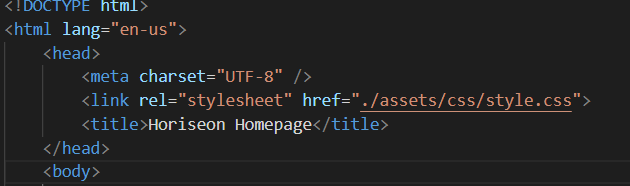
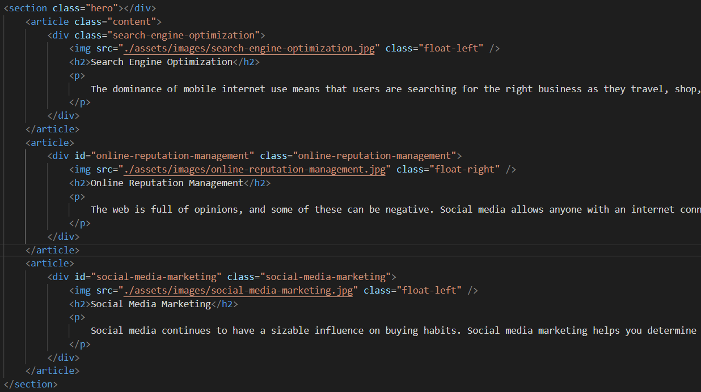
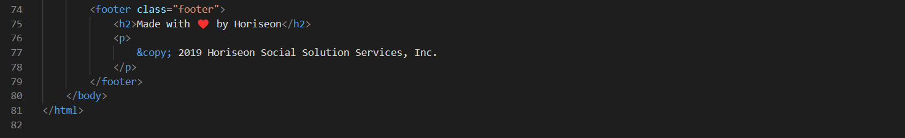
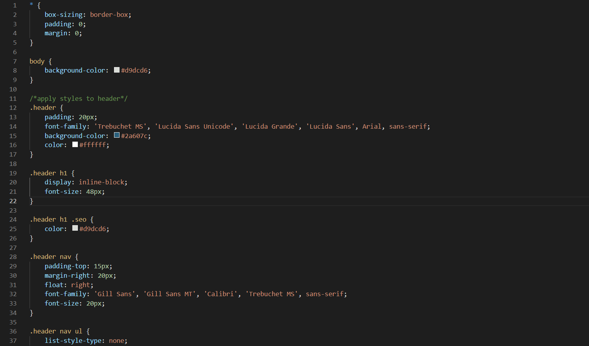
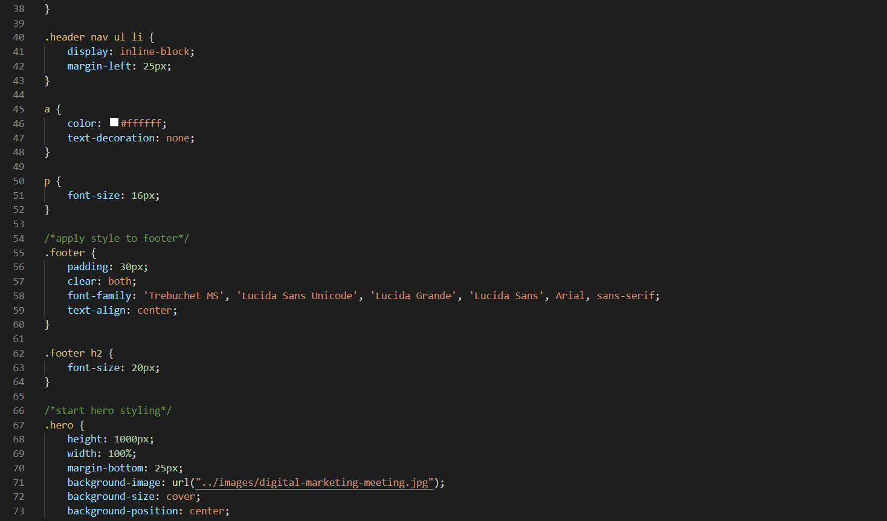
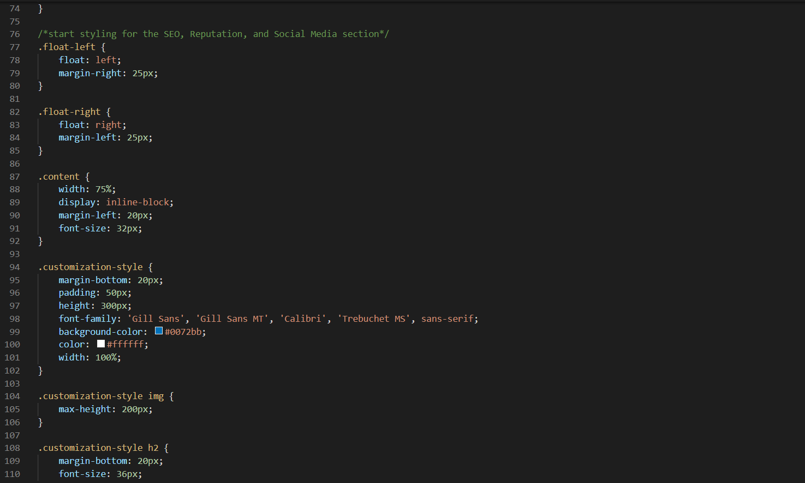
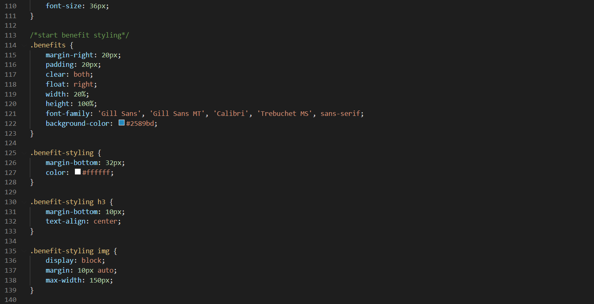

# Project Title: Refractor of Horiseon Website

⚙️ Main goals of the project:  
    1. Update codebase to follow accessibility standards and optimize the site for search engines  
    2. Ensure that the code follows semantic HTML  
    3. Ensure that the CSS code is cascading correctly and is free of repeating code 

✅ Main goals will be achieved when the webpage meets accessibility standards. The criteria for having an accessible website are:  
* When I view the source code - then I find semantic HTML elements  
* When I view the structure of the HTML elements - then I find that the elements follow a logical structure independent of styling and positioning  
* When I view the image elements - then I find accessible alt attributes  
* When I view the heading attributes - then they fall in sequential order  
* When I view the title element - then I find concise, descriptive title  

## 🗒️HTML File Updates:

**Changes made to fulfill criterias: When I veiw the source code - then I find semantic elements;   When I view the structure of the HTML elements - then I find that the elements follow a logical structure independent of styling and positioning**  

* Adjusted the head and body to be tabbed in from HTML and removed unnecessary line spaces.
* Changed the div tag for the header to be a header tag as well as its respective closing tag.
* Changed the div encompassing the Ul to be a nav tag.
* Changed the div tag for the hero to be a section tag and moved the closing tag for the section to it's appropriate spot at the bottom of the code block. Split the hero section from the SEO, Reputation, and Social Media Section.
* Changed the tags for the "search engine optimization", "online reputation management", and "social media marketing" content blocks to article tags and added respective closing tags. Also enclosed the article tags within open and ending section tags.
* Assigned the class "content" to the section encompassing the SEO, rep, and Social media articles
* Removed the div tags in the SEO, rep, and social media section and put the id and class selectors on the article tag line instead.
* Changed the div tag for the benefit to be a section tag as well as its respective closing tag. I left the tags inside of the benefit section as divs since their content isn't independent content.
* Changed the div tag for the footer to be a footer tag as well as its respective closing tag.

**Changes made to fulfill criteria: When I view the image elements - then I find accessible alt attributes**  
* Added alt attributes to the "search engine optimization", "online reputation management", and "social media marketing" images.
* Added alt attributes to the benefit lead, cost, and brand images.

**Changes made to fulfill criteria: When I view the heading attributes - then they fall in sequential order**  
* No changes made but did confirm that the headers were in sequential order.

**Changes made to fulfill criteria: When I view the title element - then I find concise, descriptive title**  
* Changed the title in the head to be Homepage-Horiseon following semantic html to indicate where the user is located on the website.

 

## 🗒️CSS File Updates to ensure that the CSS code is cascading correctly and is free of repeating code:

**Changes made to Header Section:**
* Changed the divs to be nav to correspond with the HTML updates to the header section.

**Changes made to Hero Section:**
* Created its own section in the HTML file and made the hero class in the CSS file its own.

**Changes made to SEO, Rep, Social Media section**
* Moved the stylings for the SEO, Rep, and Social Media section to be above the stylings for the benefits section.
* Combined the styling for the SEO, rep, and social media section articles into one class to use across all three articles. Also combined the classes for their h2 headers as well as their images.

**Changes made to Benefits Section:**
 * Combined the styling for the benefit cost, lead, and brand section divs into one class to use across all three divs. Also combined the classes for their h3 headers as well as their images.

**Changes made to the Footer Section:**
* Moved the footers css styling to be under the header styling

 

## 📷 Screenshots of final HTML Code for reference:

 

## 📷 Screenshots of final CSS code for reference:

